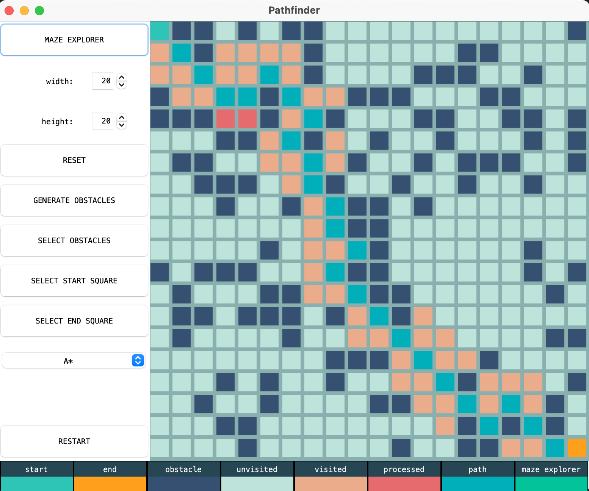
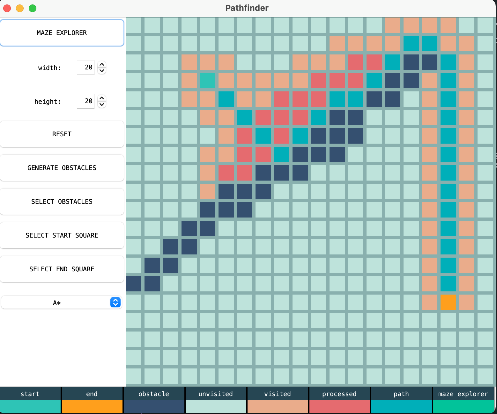
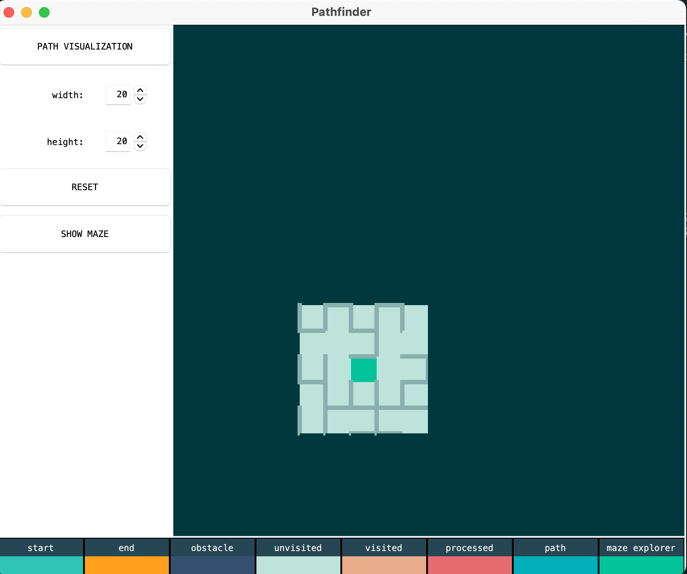

# Pathfinding Visualizer

## Table of Contents
- [Pathfinding Visualizer](#pathfinding-visualizer)
  - [Table of Contents](#table-of-contents)
  - [General Information](#general-information)
  - [Program features](#program-features)
  - [Algorithms](#algorithms)
  - [Screenshots](#screenshots)
  - [Technologies Used](#technologies-used)
  - [Credits](#credits)

## General Information
The project's aim was to implement detailed visualization of various pathfinding algorithms utilizing a multitude of object-oriented programming concepts and principles. It was created as a part of the OOP class at the AGH University of Science and Technology. 

## Program features

The program contains two modes: Pathfinding visualizer and Maze explorer. 

In the first one the user can set start position, end point, as well as put down walls/obstacles on a 2D grid. The dimensions of the grid are adjustable and one can choose an algorithm from given list. 

In the Maze mode the user controls the current square position using arrow keys while exploring the maze and looking for the end point. The maze is generated using a BFS-based method.

## Algorithms

The project was specifically designed in a way to allow visualizing any pathfinding algorithm. Currently there are four implemented strategies:

* A*
* Dijkstra's
* Breadth-First Search
* Depth-First Search

## Screenshots

Pathfinding:

Maze exploring:

## Technologies Used
- **Java**
- Swing
- JUnit 4.13.1

## Credits
Created by [@mhawryluk](https://www.github.com/mhawryluk), 2020.